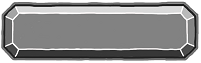
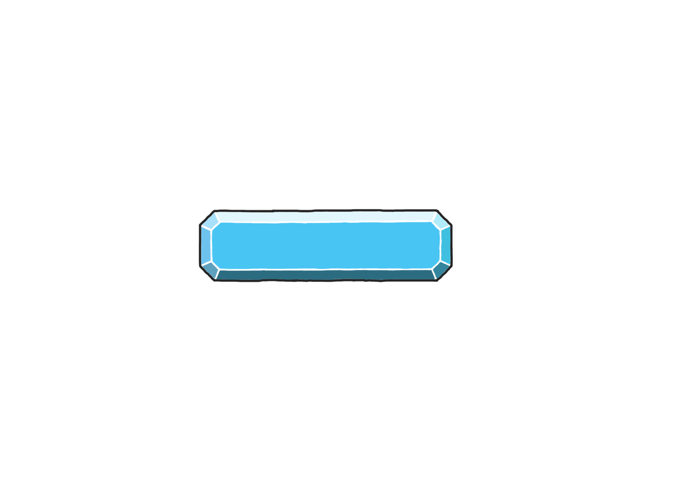

# Jazz Odyssey
 
 <!-- Nav -->
<table style="border:0px none;" width="100%">
	<tr>
		<td width="25%"> <a href="index.html"> Home </a> </td>
		<td width="25%"> <a href="amsBlog.html">Ashleys Blog</a> </td>
		<td width="25%"> <a href="jakobBlog.html">Jakob's Blog</a> </td>
		<td width="25%"> <a href="joshBlog.html">Josh's Blog</a> </td>
	</tr>
</table>

<!-- Main Content -->

### How To Play

When you first launch the game, you will appear in the safe area known as the Haven. The Haven is your home within the story and the central location on the map. When you tap on the portal, you will be taken to an overview map of the world, where you can see the various islands which act as the levels for the game. Selecting an island from the map will return you to the Haven and the portal will become activated. Tapping on the portal again will take you to the selected level.

While in the level, various notes will fall towards the bottom of the screen in typical rhythm game style. Most notes are standard notes and tapping them within the time window increases your score. Some notes are special notes which need to be swiped or held. However, some notes are slightly different and are intended to distract the player. Tapping too many of these false notes, or simply missing too many notes, will cause you to fail the level. If you get to the end of the song you have defeated the boss and completed the level. You will get a score for the level and then return back to the Haven where you can continue on to fight other bosses. 

### Notes You'll Encounter
<table>
  <tr>
	<th>Image</th>
	<th>Description</th>
  </tr>
<tr>
	<td></td>
	<td>Default notes are tapped</td>
</tr>
<tr>
	<td></td>
	<td>Swipe notes are swiped</td>
</tr>
<tr>
	<td></td>
	<td>Hold notes are held. They're also blue?</td>
</tr>
<tr>
	<td></td>
	<td>Golden notes are super tapped, they're worth lots of score! </td>
</tr>
<tr>
	<td></td>
	<td>Poison notes are ouch but give score, tap if you dare!</td>
</tr>
<tr>
	<td><!----></td>
	<td>Fake notes aren't even there, it's all in your head, do not tap! </td>
</tr>
</table>

[Default]: https://raw.githubusercontent.com/overscopestudio/overscopestudio.github.io/master/ "One tappy boi"
[Swipe]: https://raw.githubusercontent.com/overscopestudio/overscopestudio.github.io/master/Images/Notes/Right%20Swipe.png "Swipe me daddy"
[Hold]: https://raw.githubusercontent.com/overscopestudio/overscopestudio.github.io/master/Images/Notes "Hold me close"
[Golden]: https://raw.githubusercontent.com/overscopestudio/overscopestudio.github.io/master/Images/Note "money money money"
[Poison]: https://raw.githubusercontent.com/overscopestudio/overscopestudio.github.io/master/Images/Notes "Looks more spiky than poisonous but whatever"
[Fake]: https://raw.githubusercontent.com/overscopestudio/overscopestudio.github.io/master/Images/Notes/Mike1.png "Mike is placeholder for the fake notes"

### Unique Selling Points

- Jazz Odyssey is a one-of-a-kind fusion of rhythm games and boss-rush games.

- An audacious attempt to combine rhythm games with music of the jazz genre.

- A cel-shaded, cartoony escapade of goofy aliens powered up by magic, jazz instruments and magical jazz instruments!

### Screenshots

### Trailer 

<iframe width="600" height="400" src="https://www.youtube.com/embed/GvPTA4dx6gA" frameborder="0" allow="accelerometer; autoplay; encrypted-media; gyroscope; picture-in-picture" allowfullscreen></iframe>
