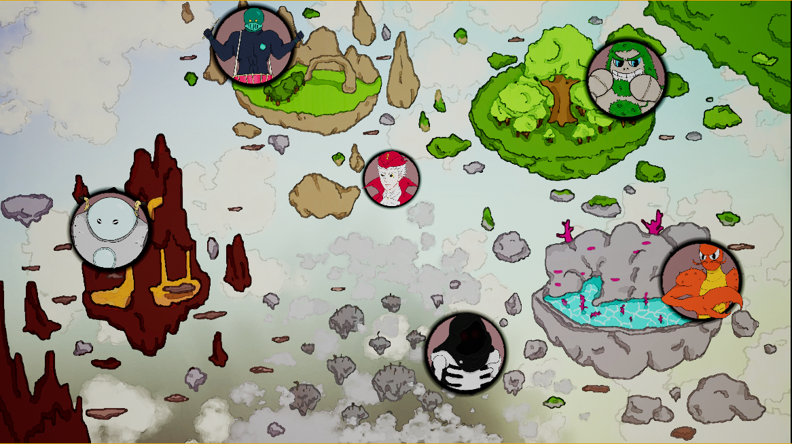
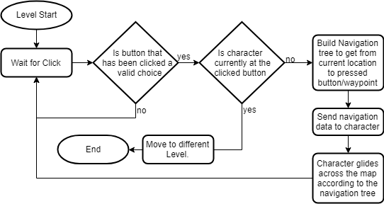
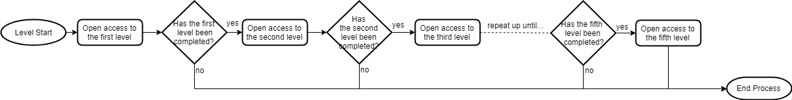

# Josh's Blog
 
 <!-- Nav -->
<table style="border:0px none;" width="100%">
	<tr>
		<td width="25%"> <a href="index.html"> Home </a> </td>
		<td width="25%"> <a href="amsBlog.html">Ashleys Blog</a> </td>
		<td width="25%"> <a href="jakobBlog.html">Jakob's Blog</a> </td>
		<td width="25%"> <a href="joshBlog.html">Josh's Blog</a> </td>
	</tr>
</table>

<!-- Main Content -->

## Main Menu Navigation Map
##### Date: 11/04/2019

I'm Josh, the youngest of three programmers working on Jazz Odyssey. My main project within this game was creating a menu map that would act as a central point within the game and act as a transition between the levels.

<details><summary> The final outcome looked like this: </summary>
<p>  </p> </details>

There are 5 buttons around the map, each in their own unique area, and the single player sprite in the center, as well as many invisible waypoints scattered around that create the paths.

When I started thinking about this problem, I thought about a couple of ways I could go about setting this all up. I ended up going with the idea I would need a sort of Tree of objects in the scene, which would act as waypoints for the player to navigate across.
I created very crude actors to begin with, and scattered them around the map. I then created the player which received a location from the buttons when pressed, and then navigated to that location.
<details><summary>The crude code worked something like this:</summary>
<p>

```
// BUTTON // 
when button clicked:
	get location of self,
	send location to player object.
	
	
// PLAYER OBJECT //
loop forever:
	wait until a location is received WHEN I'm not busy,
	set self to busy,
	travel to location that was received,
	set self to NOT busy,
```

</p></details>

I very quickly scrapped this, as it was not expandable whatsoever and was more or less a proof of concept for my team.

Now onto making this expandable, I had little idea as to what I could do.
I thought up a new solution, and it was by ditching the old button all together and creating two different types of buttons. I started with a base class that would have both the buttons derive from it, the base class contained any shared property that was between them, at the time this was just a boolean that stored whether the button could be clicked or not.
I then derived the two button types from the base, Head and Leaf, basing it on the Tree data structure. The leaves where relatively simple, they could store an object that was in front of them, and when clicked, would first check if it was allowed to be clicked before sending its location to the object in front of it. If the object was another leaf, the next leaf would add its location to an array, and send the array forwards. The process repeated until the array of locations would be received by the Head.
When the Head received the array, it sent it the the Player object and it moved across the map according to the array.

I thought what I had done was great, so I ended my day with this complete. However when I came back to it a while later, I took one look at it and realised it could be so much better. So I scrapped it completely and start again from the ground up.

In this attempt, I created the pseudo-recursive algorithm that I mention in my technical poster. The button that gets clicked is no longer sends it's location to the Head at the center, it instead travels through all of the leaves in line until it reaches the Head. The location from the head is now the first added to the array, and is returned to the leaf that it is connected to. While traveling back along the stack of processes, each leaf adds its own location to the array before returning it. When the process is complete and the array reaches the button that was initially pressed, the buttons location is added to the array before the whole array is sent to the Player Object. The Player Object has the same functionality as before. The Head now also does nothing, as previously it handled sending data to the man, but it is now handled by each button. 

<details> <summary> A flowchart to show in short the process behind the Leaves </summary>
<p>

</p> </details>

This is what worked best at the time, but now looking back I would change it again so that the Head handles the communication with the Player Object. This saves all the buttons being linked to the Player Object when it could be just the Head which is linked.

I encountered my fair share of bugs while developing this, all of which were sorted with either a little bit of help from my team, or after giving it a fresh look the next day.

Towards the end of the project, I needed to make the map and the access to levels work with save game system. To do this I created a Manager that can interact with all the buttons and adjust some properties according to the save data. Working with the save system created by another one of my teammates was awkward at first, as our coding styles and approach to problems differ greatly. In the end, all worked out fine.

<details> <summary> The simple flowchart about the save system </summary>
<p>

</p> </details>

<details> <summary> And the slightly less simple Pseudo code of almost what is happening </summary>
<p>

```
// this is called at the start of the game, and whenever the player returns to the map
SetAllLevelAccess()
	Check ( first_level )
	IF first_level IS completed
		Check ( second_level )
		IF second_level IS completed
			Check ( third_level )
			IF third_level IS completed
				Check ( fourth_level )
				IF fourth_level IS completed
					Check ( fifth_level )

Check( number_level )
	find button that corresponds to number_level,
	make it so the button is clickable and visible,
	// in the save system...
	IF the level corresponding to number_level IS locked -> set it to unlocked
	IF the level corresponding to number_level IS completed
		// (will enter the next loop in SetAllLevelAccess()
```

</p> </details>

The end result is an interactive map that the player can navigate around with touch presses (did I mention this is a all for mobile). When the game first starts only the first level will be visible and accessible, but as you complete levels the next level becomes an option, while the previous level stays around to be replayed if desired by the player.

Now, all the actual final code in all its "glory". I have only included the .cpp files for the most important components; the Leaf, the Player Object and the Manager.

<details> <summary> The manager </summary> <p>

In here, gameInst is the save game system I have mentioned

```
// Called when the game starts or when spawned
void AMenuButtonManager::BeginPlay()
{
	Super::BeginPlay();
	SetAllLevelAccess();
}

void AMenuButtonManager::SetAllLevelAccess()
{
	if (IterAndUpdate(ELevelType::FirstLevel)) // will set first level to active, and if level has been complete will enter the loop
	{
		if (IterAndUpdate(ELevelType::SecondLevel)) // will set second level to active, and if level has been complete will enter the loop
		{
			if(IterAndUpdate(ELevelType::ThirdLevel))
			{
				if (IterAndUpdate(ELevelType::FourthLevel))
				{
					IterAndUpdate(ELevelType::FinalLevel);
				}
			}
		}
	}
}

// updates and activates levels according to the inputted params, 
//		at the end returns a bool telling if the next set of levels can be unlocked too. 
bool AMenuButtonManager::IterAndUpdate(ELevelType searchTerm)
{
	UMainGameInstance* gameInst = Cast<UMainGameInstance>(GetGameInstance());

	bool levelCompleted = false;
	for (auto leaf : buttons)
	{
		PortalData leafData = leaf->getLevelType();

		if (leafData.levelType == searchTerm)
		{
			leaf->setButtonClickable(true);
			leaf->setLevelAccess(true);
			
			FLevelData* levelData = gameInst->GetLoadedGameData(leafData.levelName);

			if (levelData->levelState == LevelState::Locked)
			{
				levelData->levelState = LevelState::Unlocked;
			}
			else if (levelData->levelState == LevelState::Complete)
				levelCompleted = true;
				
			leaf->SetActorHiddenInGame(false);
		}
	}

	gameInst->SaveGame();
	return levelCompleted;
}
``` 

</p> </details>

<details> <summary> The Leaves </summary> <p>

The buttons I have mentioned in this blog are all different Leaves that can be accessed by the manager

```
void AButtonLeaf::OnClick()
{
	if(isClickable && menuMan && !menuMan->GetBusy()) // If the button can be clicked and the man isnt busy right now
	{
		// checks to see if level portal can be entered (at this point in the game) and double checks its at the right place 
		if (isLevelEnterable && AtCurrentLocation())
		{
			UGameplayStatics::OpenLevel(GetWorld(), *portalToLevel_Name);
		}
		else if (nextLeaf)
		{
			travelArray = nextLeaf->BuildLocationArray();
			travelArray.Add(GetActorLocation());
			menuMan->BeginLerp(travelArray, portalToLevel_Name);
		}
		else
		{
			UE_LOG(LogTemp, Error, TEXT("That button click did nothing, uh oh"))
		}
	}
}

bool AButtonLeaf::AtCurrentLocation() 
{
	if (portalToLevel_Name == menuMan->GetCurrentLocationName())
		return true;
	else
		return false;
}

TArray<FVector> AButtonLeaf::BuildLocationArray()
{
	if (nextLeaf)
	{
		travelArray = nextLeaf->BuildLocationArray();
	}
	else 
	{
		travelArray.Add(treeHead->GetActorLocation());
	}

	travelArray.Add(GetActorLocation());
	return(travelArray);	
}

PortalData AButtonLeaf::getLevelType()
{
	PortalData data;
	data.SetupData(levelType, portalToLevel_Name);
	return data;
}
```

</p> </details>

<details> <summary> Finally, the Player Object </summary> <p>


```
void AMainMenuMan::Tick(float DeltaTime)
{
	Super::Tick(DeltaTime);
	currentTravelTime += DeltaTime;
	percentage = currentTravelTime / travelDuration;
	if (busy) {
		if (percentage > 1) 
		{
			UE_LOG(LogTemp, Warning, TEXT("Attempting Refresh"))
			RefreshEndLocation();
			UE_LOG(LogTemp, Warning, TEXT("Refresh complete"))
		}
		else 
		{
			FVector newPosition = FMath::Lerp(startLocation, endLocation, percentage);
			SetActorLocation(newPosition);
		}
	}
}

void AMainMenuMan::BeginLerp(TArray<FVector> locationArray, FString portalname) 
{
	/*
	In order,
		-> Set busy to true
		-> create currentpathinglocations
			-> Do Lerps of the Old Array backwards, starting from = 1 (so it doesnt move to its current location)
			-> Do Lerps of new passed in array, starting from i = 1 (same as above)
		-> refeshendlocation() once
		-> increment progress var
		-> store the locations in the new array, as the old array.
	
	*/

	travelProgress = 0;
	busy = true;

	currentPathingLocations.Empty();
	
	// create current pathing
	for (int i = 1; i < rerouteLocations.Num(); i++)
	{
		currentPathingLocations.AddUnique(rerouteLocations[rerouteLocations.Num() - 1 - i]);
	}

	// save locations to, so can get back to tree head on next move
	rerouteLocations = locationArray;

	// continure creating pathing
	for (int i = 1; i < locationArray.Num(); i++)
	{
		currentPathingLocations.AddUnique(locationArray[i]);
	}

	currentLocation = portalname;
	RefreshEndLocation();
	
	
}

void AMainMenuMan::RefreshEndLocation()
{
	if (busy)
	{
		startLocation = GetActorLocation();
		endLocation = GetNextLocation();
		travelDuration = FVector::Dist(startLocation, endLocation) / arbitrarySpeed;
		currentTravelTime = 0;
	}
}

FVector AMainMenuMan::GetNextLocation()
{	
	if (travelProgress >= currentPathingLocations.Num()) 
	{
		busy = false;
		//travelProgress = 0;
		return GetActorLocation();
	}
	else
	{
		FVector toReturn = currentPathingLocations[travelProgress];
		travelProgress++;
		return toReturn;
	}
}
```

</p> </details>


